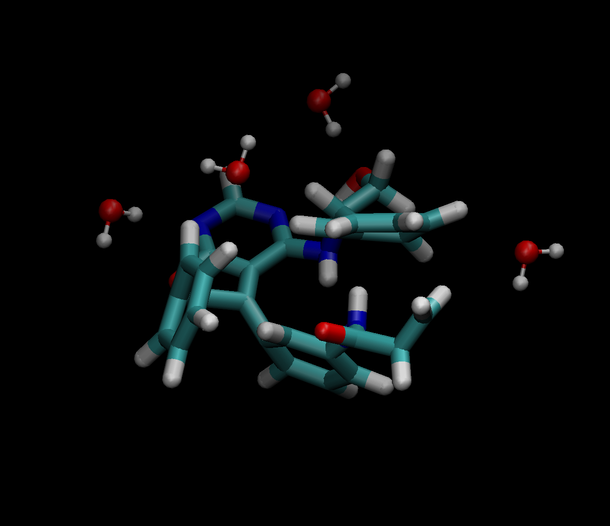

.. highlight:: rst

Solvent
=======

Defining solvent molecule
-------------------------

Solvent molecules can be easily added in analogous way to the main molecule.
First the solvent molecule is defined as a PyQchem Structure object.

Example of water:

.. code-block:: python

    solvent = Structure(coordinates=[[0.000000,  0.000000,  0.000000],
                                     [0.758602,  0.000000,  0.504284],
                                     [0.758602,  0.000000,  -0.504284]
                                     ],
                          symbols=['O', 'H', 'H'])

then the solvent molecule is added during the calculation setup:

.. code-block:: python

    calc = GromOrg(structure,
                   params=gmx_params,        # MDP parms
                   box=[30, 30, 30],         # unitcell a, b, c in angstrom
                   supercell=[1, 1, 1],      # size of supercell
                   solvent=solvent,          # solvent molecule
                   solvent_scale=0.57,       # solvent scale parameter
                   )

To adjust the density of the solvent molecule, the solvent_scale parameter can be used.
This correspond to the ``-scale`` option in the ``gmx solvate`` command.
(https://manual.gromacs.org/current/onlinehelp/gmx-solvate.html?highlight=solvate)

Extracting molecular cluster from trajectory
--------------------------------------------

To extract the molecules from the trajectory ``mdtraj_to_pyqchem`` can be used as previously.
However, when including the solvent it becomes convenient to extract not only the main molecule
but also some of closest solvent molecules. For this purpose ``get_cluster`` function can be used.

.. code-block:: python

    cluster = get_cluster(trajectory, iframe, ires, cutoff=5.0, center=True)

where ``iframe`` is the frame number, ``ires`` is the residue number and ``cutoff`` is the distance cutoff.
Also, ``center`` is a boolean parameter that can be used to center the molecule on the origin. The return
value is a PyQchem Structure object that contains the molecule corresponding to ires and the molecules
surrounding it at less than ``cutoff`` distance.

.. note::
    Notice that in the trajectory the first residue indices always correspond to the main molecule while the
    others are solvent molecules. Using the value defined in ``supercell`` the user can figure out how many
    main molecules are present in the trajectory.

   Simple example of the Structure (main mol + solvent) obtained using ``get_cluster`` function.